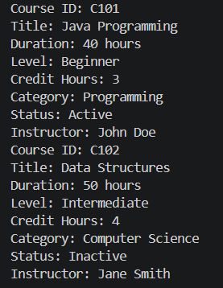

# NFS_JAVA_C2_2026 | Full-Stack Development with Java, React & MongoDB

## Programme Description

This 20-day programme is designed to help participants build a complete full-stack web application using Java, Spring Boot, React, and MongoDB.

The programme takes learners from programming and web fundamentals to backend API development, frontend interface design, database modelling, authentication, testing, performance improvement, and final capstone presentation.

Throughout the programme, participants will work on practical exercises and gradually build a small but production-like web application. The final outcome is a working capstone project that demonstrates the use of a React frontend, Spring Boot backend, MongoDB database, secure authentication, API documentation, testing practices, and deployment-readiness basics.

AI tools such as Gemini are used as learning accelerators to help scaffold examples, suggest refactoring ideas, draft tests, generate sample data, and support MongoDB query or aggregation design. However, participants are expected to review, verify, understand, and take ownership of all generated code.

---

## Programme Duration

* Duration: 20 training days

* Daily Duration: 7 hours per day

* Total Training Hours: 140 hours

* Mode: Instructor-led training with guided labs, team build activities, review sessions, quizzes, and capstone development

---

## Programme Objectives

By the end of this programme, participants will be able to:

* Understand web fundamentals, HTTP, REST, and JSON.

* Write basic to intermediate Java and JavaScript code.

* Build REST APIs using Spring Boot.

* Apply validation, authentication, authorisation, and error-handling practices.

* Model data effectively using MongoDB.

* Use MongoDB indexes, queries, pagination, and aggregation pipelines.

* Build accessible React user interfaces with routing, forms, state, and data fetching.

* Apply testing practices for backend and frontend development.

* Use AI coding assistants responsibly for learning, refactoring, testing, and documentation.

* Design, build, document, and present a full-stack capstone project.

---
## Day 1 Exercise 01 - Code Explanation
What is the purpose of Course.java?
ANS: It represents a course with details like ID, title, duration, level, and credit hours. It also holds a reference to an Instructor and has a printSummary() method to display all course info.

What is the purpose of Instructor.java?
ANS: It represents an instructor with fields for ID, name, and expertise. It has getters and a printProfile() method to display the instructor's details.

What is the purpose of Student.java?
ANS: It's a placeholder for future student data like name, ID, enrolled courses.

What does the constructor do?
ANS: The constructor such as in Course.java is a special method that runs when you create a new Course object. It takes values as arguments and uses this.field = value to assign them to the object's fields. 

Why are the fields marked as private?
ANS: private means the field can only be accessed from inside its own class while outside code can't read or change it directly. This protects the data from accidental or unauthorized changes.

What does course1.assignInstructor(instructor1); mean?
ANS: This would call a method named assignInstructor on the course1 object, passing an Instructor object as the argument.

What does student1.printProfile(); do?
ANS: It would call the printProfile() method on a Student object, printing that student's details to the console.

AI-Assisted Task: Use the AI of your choice (ChatGPT, Gemini, Claude, Windsurf) and ask:
Explain this Java class to someone who already knows Python or C++.

Then write down:
One explanation from AI that helped you.
ANS: In Python you can just do course.title directly. In Java, private blocks that - so instead you use getTitle() to read and setTitle() to change it. It feels like extra work, but it gives you control over how the data is accessed or validated before it's changed.

One part you still needed the trainer or your own reading to understand.
ANS: why not all setter function didnt need to defined in the code ?

## Day 1 Exercise 02 - Improve the Course Class
Screenshot of updated course output.

Brief explanation of what changed in Course.java.
ANS:
1. Added two new fields — category (String) to group the course type e.g. Programming, Frontend, Database, and active (boolean) to indicate whether the course is currently running.
2. Updated the constructor — Both category and active are now parameters, so every Course object must be given these values when created.
3. Added two new getters — getCategory() returns the category and isActive() returns the active status. Boolean getters use is instead of get by Java convention.
4. Updated printSummary() — Instead of printing true or false, it now prints "Active" or "Inactive" using a ternary operator: (active ? "Active" : "Inactive").

## Day 1 Exercise 03 - Add a CourseOffering Class
Why is CourseOffering more useful than using only Course when building a real web application?
ANS: A Course is just a template — it holds the general info like title, 
category, and duration. But in a real web application, the same course can 
run multiple times with different instructors, dates, and capacity limits. 
CourseOffering represents one specific scheduled run of that course. 
For example, "Java Fundamentals" can have a June 2026 intake and a 
September 2026 intake as two separate offerings. This makes it easier 
to manage enrolments, track batches, and support different delivery modes 
like Online or Physical — without duplicating the course data each time.

I use AI to :
ANS: help me with tthe oject instances, help me to fill the details of the requirements but i understand the tasks clearly

---

## AI-Assisted Learning Guidelines

Participants may use AI tools to:

* Generate README drafts and documentation sections.

* Create API call examples and JSON payload samples.

* Suggest method signatures and edge cases.

* Propose refactoring options.

* Draft test scenarios for backend and frontend features.

* Suggest MongoDB document structures, queries, indexes, and aggregation pipelines.

* Improve demo scripts and presentation notes.

Participants must always review, verify, test, and understand any AI-generated output. No passwords, API keys, tokens, private keys, or confidential data should be placed into AI prompts.

