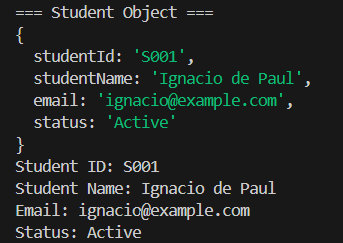
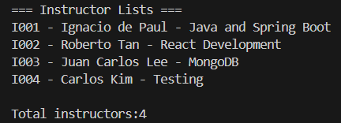
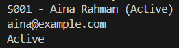
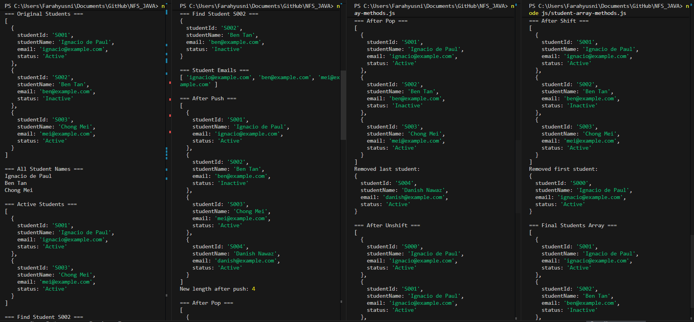

# NFS_JAVA_C2_2026 | Full-Stack Development with Java, React & MongoDB

## Programme Description

This 20-day programme is designed to help participants build a complete full-stack web application using Java, Spring Boot, React, and MongoDB.

The programme takes learners from programming and web fundamentals to backend API development, frontend interface design, database modelling, authentication, testing, performance improvement, and final capstone presentation.

Throughout the programme, participants will work on practical exercises and gradually build a small but production-like web application. The final outcome is a working capstone project that demonstrates the use of a React frontend, Spring Boot backend, MongoDB database, secure authentication, API documentation, testing practices, and deployment-readiness basics.

AI tools such as Gemini are used as learning accelerators to help scaffold examples, suggest refactoring ideas, draft tests, generate sample data, and support MongoDB query or aggregation design. However, participants are expected to review, verify, understand, and take ownership of all generated code.

---

## Programme Duration

* Duration: 20 training days

* Daily Duration: 7 hours per day

* Total Training Hours: 140 hours

* Mode: Instructor-led training with guided labs, team build activities, review sessions, quizzes, and capstone development

---

## Programme Objectives

By the end of this programme, participants will be able to:

* Understand web fundamentals, HTTP, REST, and JSON.

* Write basic to intermediate Java and JavaScript code.

* Build REST APIs using Spring Boot.

* Apply validation, authentication, authorisation, and error-handling practices.

* Model data effectively using MongoDB.

* Use MongoDB indexes, queries, pagination, and aggregation pipelines.

* Build accessible React user interfaces with routing, forms, state, and data fetching.

* Apply testing practices for backend and frontend development.

* Use AI coding assistants responsibly for learning, refactoring, testing, and documentation.

* Design, build, document, and present a full-stack capstone project.

---

## Day4_Exercise_01_JavaScript_Object
QUESTION : What is one difference between a Java object and a JavaScript object?
- In Java, you must define a class first (like Student.java) before creating an object from it. In JavaScript, you can create an object directly using {} without any class definition.

Output : 

## Day4_Exercise_02_Arrays_And_Loops
QUESTION : How is a JavaScript array similar to Java ArrayList?
- Both can grow dynamically (no fixed size), store multiple items, and be looped through. In Java you use ArrayList<> with .add() and .size(); in JavaScript you use [] with .push() and .length.

OUTPUT :

## Day4_Exercise_03_Functions_And_Arrow_Functions
QUESTION : Why are arrow functions important before learning React?
- React uses arrow functions heavily for event handlers, callbacks, and functional components. Learning arrow functions now makes React code easier to read and write, since most React examples and tutorials are written using arrow function syntax.

OUTPUT :

## Day4_Exercise_04_Array_Methods
1. What is the difference between filter, find, and map?
- filter returns a new array of all items that match a condition. find returns only the first matching item (one object). map returns a new array by transforming every item.

2. Which four array methods change the original array?
- push, pop, shift, unshift

3. What does push return?
- push returns the new length of the array after the item is added.

4. What does pop return?
- pop returns the item that was removed from the end of the array.

5. What is the difference between shift and unshift?
- shift removes the first item from the array. unshift adds a new item to the beginning of the array.

OUTPUT :

---

## AI-Assisted Learning Guidelines

Participants may use AI tools to:

* Generate README drafts and documentation sections.

* Create API call examples and JSON payload samples.

* Suggest method signatures and edge cases.

* Propose refactoring options.

* Draft test scenarios for backend and frontend features.

* Suggest MongoDB document structures, queries, indexes, and aggregation pipelines.

* Improve demo scripts and presentation notes.

Participants must always review, verify, test, and understand any AI-generated output. No passwords, API keys, tokens, private keys, or confidential data should be placed into AI prompts.

